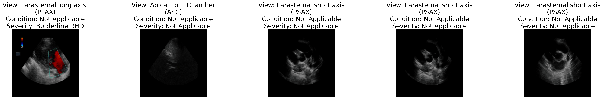

## Self-Supervised Multi-Task Learning for Detection and Classification of RHD-Induced Valvular Pathology

## Overview

This project aims to develop a robust multi-task classification system for echocardiographic views and pathology using self-supervised learning approaches, specifically SimCLR and DINOv2. Echocardiography is crucial for diagnosing rheumatic heart disease (RHD), but automated analysis of echocardiogram views presents significant challenges, especially in resource-limited settings. This project leverages both labeled and unlabeled data to improve classification accuracy.

## Methodology

### SimCLR
SimCLR (Simple Contrastive Learning of Visual Representations) is used for self-supervised learning. It utilizes a ResNet-18 backbone with a projection head for contrastive learning. The model is trained to maximize agreement between differently augmented views of the same data point.

### DINOv2
DINOv2 (Distillation with No Labels) is another self-supervised learning approach that uses knowledge distillation to learn visual representations without labels. It complements SimCLR by providing additional robust features for classification tasks.

### Multi-Task Learning
The architecture includes linear classifiers tailored for specific tasks such as:
- View classification
- Valve condition classification
- Disease severity assessment

The dataset comprises annotated echocardiogram frames with three types of labels—view, condition, and severity—as well as additional unlabeled frames used for self-supervised pre-training.


## Installation

Clone the repository:
    ```
    git clone https://github.com/lmugambi/rhd-ssl-multitask.git
    cd rhd-ssl-multitask
    ```


## Results
The project includes visualization tools to analyze the training process and the learned representations:

- t-SNE and UMAP visualizations of embeddings
- Confusion matrices for classification tasks


