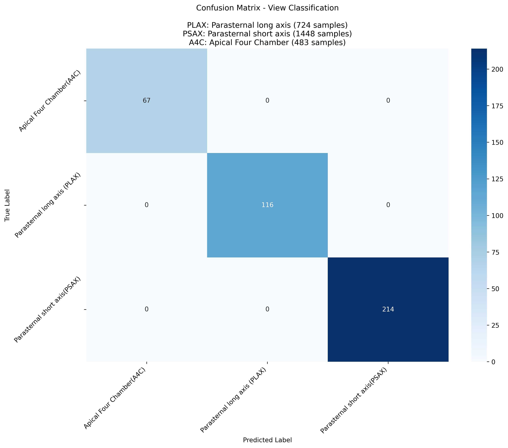
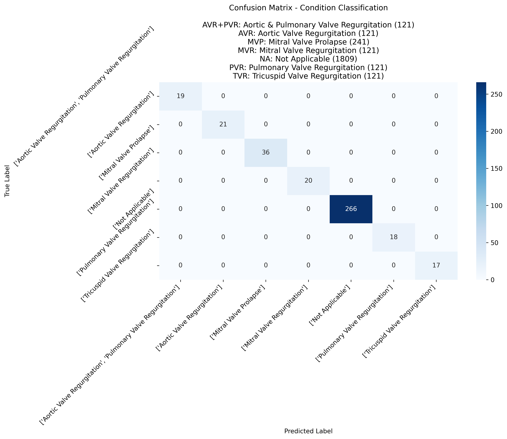
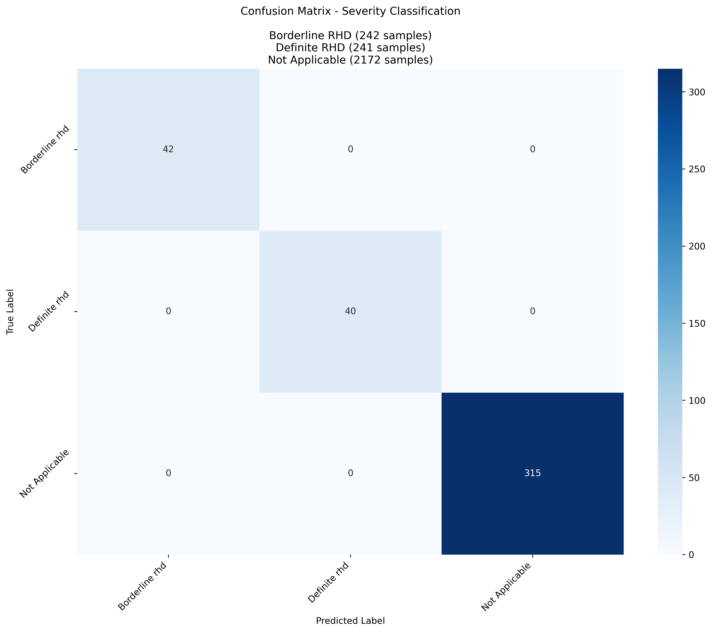
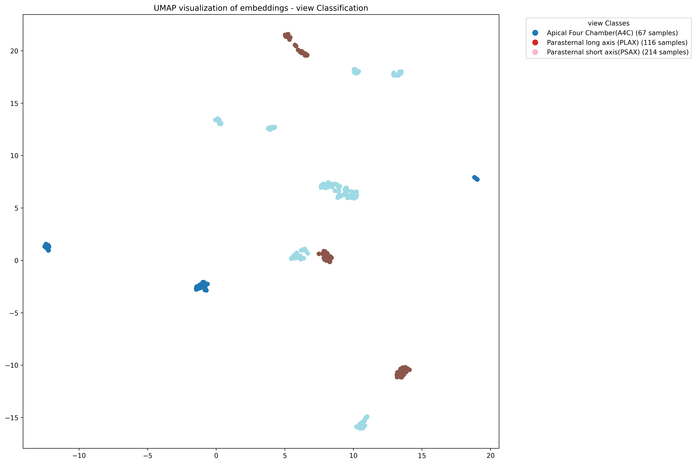
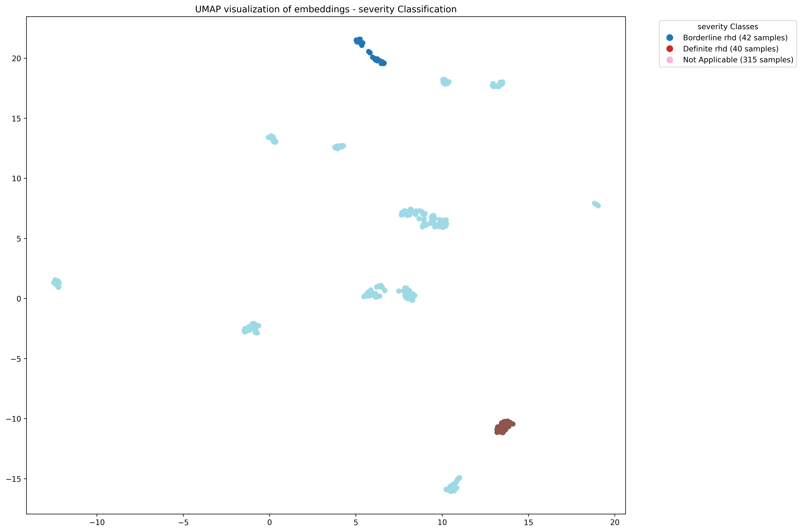

# Multi-Task Learning with DINOv2 for Echocardiogram Classification

This repository contains scripts for training a multi-task classification model using DINOv2 backbone for echocardiogram analysis. The model simultaneously predicts view, condition, and severity from echocardiogramic images.

## Project Structure
```
├── dataset.py # Dataset class for handling GCP bucket data
├── metrics.py # Evaluation metrics and visualization functions
├── model.py # DINOv2 multi-task model architecture
├── train.py # Training loop and evaluation functions
├── visualize.py # Functions for visualizing samples and results
└── main.py # Main script to run the training pipeline
```

## Requirements
```
cd dinov2-rhd
pip install -r requirements.txt
```

## Setup
1. Ensure you have Google Cloud credentials set up:
```
export GOOGLE_APPLICATION_CREDENTIALS="path/to/your/credentials.json"
```
2. Prepare your data:
   - Organize images in a GCP bucket
   - Create a CSV file with columns: FILE_PATH, VIEW-APP, CONDITION, SEVERITY

## Usage
Basic command:
```
python main.py \
--bucket your-bucket-name \
--labelled-prefix path/to/labelled/data \
--unlabelled-prefix path/to/unlabelled/data \
--csv-file path/to/labels.csv \
--batch-size 32 \
--epochs 100 \
--learning-rate 1e-4 \
--patience 7

```

## Outputs
The script creates a timestamped directory in `outputs/` containing:
- Training logs
- Sample visualizations
- Training curves
- Confusion matrices
- Embedding visualizations (UMAP and t-SNE)
- Test metrics

## Model Architecture
- Backbone: DINOv2
- Task-specific heads for:
  - View classification
  - Condition classification
  - Severity classification

## Features
- Multi-GPU support
- Mixed precision training
- Early stopping
- Learning rate scheduling
- Comprehensive metrics and visualizations
- Support for both labeled and unlabeled data

## Monitoring Training
To monitor the training progress:
```
tail -f dino_rhd.txt
```


## Results
The model outputs:
1. Performance metrics for each task:
   - Accuracy
   - Precision
   - Recall
   - Specificity
   - F1 Score

| Task       | Accuracy | Precision | Recall | Specificity | F1 Score |
|------------|----------|-----------|--------|-------------|----------|
| **View**      | 1.0000   | 1.0000    | 1.0000 | 1.0000      | 1.0000   |
| **Condition** | 1.0000   | 1.0000    | 1.0000 | 1.0000      | 1.0000   |
| **Severity**  | 1.0000   | 1.0000    | 1.0000 | 1.0000      | 1.0000   |

2. Visualizations:
   - Confusion matrices with actual label names


   - UMAP and t-SNE embeddings with class legends
   

   
   - Training and validation curves

To run the script in the background and save output to dino_rhd.txt:
```
nohup python main.py \
    --bucket your-bucket-name \
    --labelled-prefix echocardiograms/labeled \
    --unlabelled-prefix echocardiograms/unlabeled \
    --csv-file metadata/labels.csv \
    --batch-size 32 \
    --epochs 100 \
    --learning-rate 1e-4 \
    --patience 7 > dino_rhd.txt 2>&1 &
```