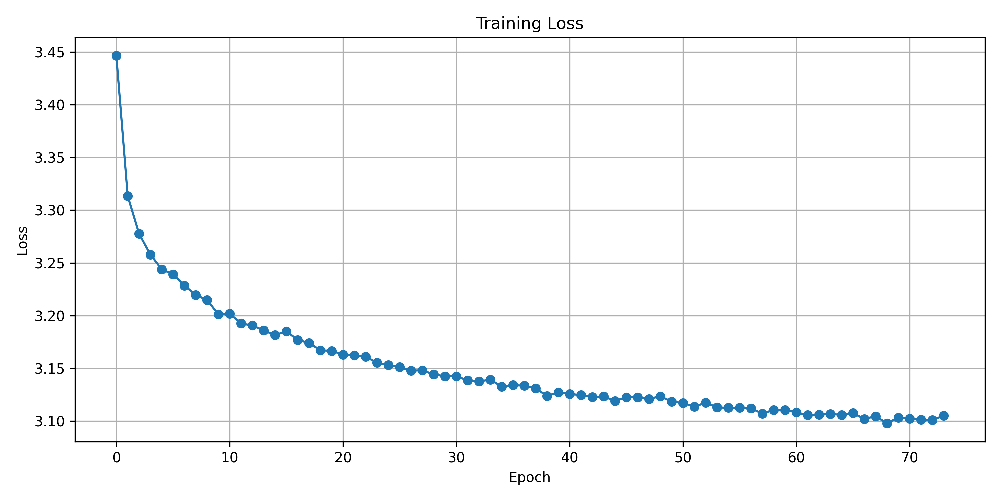
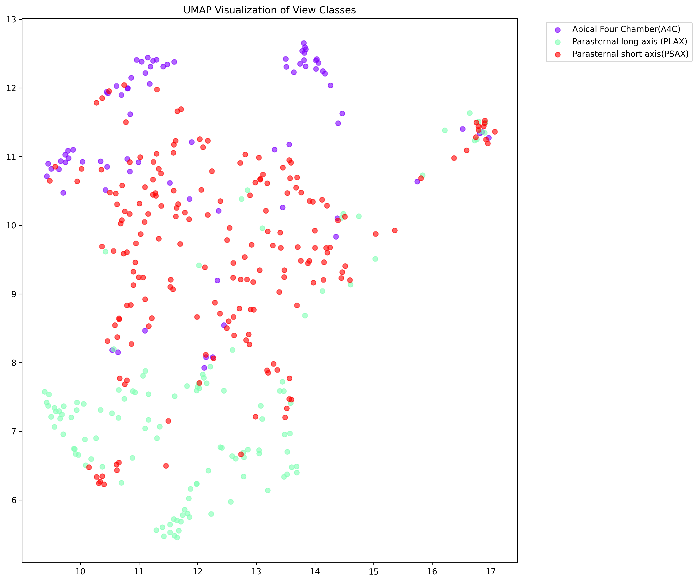
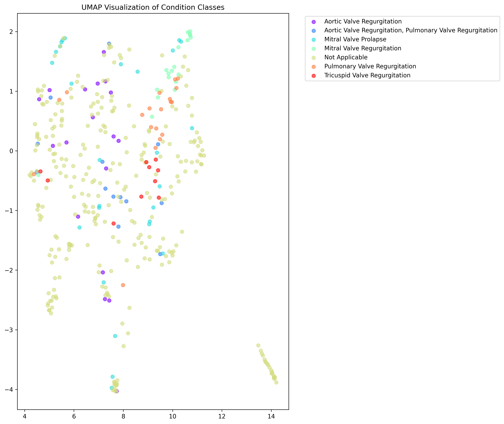
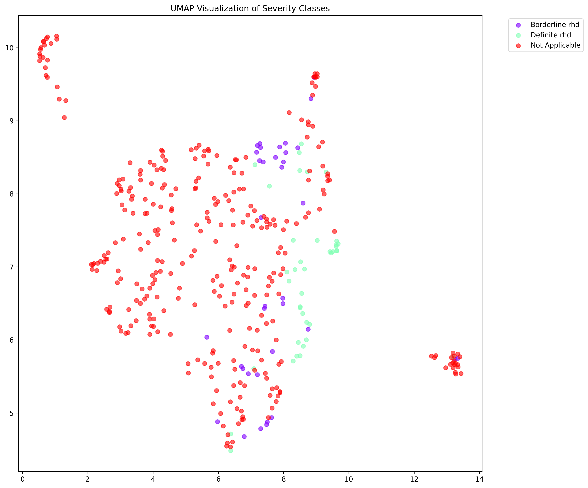

## Multi-Task Echocardiographic View and Pathology Classification using Simple Contrastive Learning

The project focuses on developing a robust multi-task classification system for echocardiographic views and pathology using a simple contrastive learning approach. Echocardiography plays a crucial role in diagnosing rheumatic heart disease (RHD), but automated analysis of echocardiogram views presents significant challenges, especially in resource-limited settings. This project aims to address these challenges by leveraging both labeled and unlabeled data to improve classification accuracy.

The methodology revolves around the SimCLR framework for self-supervised learning, utilizing a ResNet-18 backbone. The architecture includes a projection head for contrastive learning and linear classifiers tailored for specific tasks such as view classification, valve condition classification, and disease severity assessment. The dataset comprises annotated echocardiogram frames with three types of labels—view, condition, and severity—as well as additional unlabeled frames used for self-supervised pre-training.

To enhance the model's performance, specialized data augmentation techniques are employed. These include padding for aspect ratio normalization, random resized cropping, color jittering, Gaussian blur, and random grayscale conversion, all tailored for medical imaging. The training strategy is divided into two main phases: self-supervised pre-training and supervised fine-tuning. During the self-supervised phase, contrastive learning is applied to the unlabeled data using the NT-Xent loss function, with early stopping based on the contrastive loss. In the supervised fine-tuning phase, separate linear classifiers are trained for each task using cross-entropy loss, and task-specific evaluation metrics are employed to assess performance.

The implementation leverages the PyTorch framework and integrates with Google Cloud Storage for data handling. It supports multi-GPU training and includes tools for logging and visualization. The training pipeline involves loading data from GCP, model training and validation, metrics computation, and visualization generation. Visualization techniques such as t-SNE and UMAP are used to analyze the learned representations, and training progress is monitored through loss curves and confusion matrices.

Evaluation of the model is conducted using task-specific metrics like accuracy, precision, recall, F1-score, and specificity, with a focus on per-class performance analysis. The validation strategy includes dataset splits and cross-validation considerations, with early stopping criteria to prevent overfitting. Practical considerations such as GPU memory requirements, training time estimates, and batch size optimization are also taken into account to ensure efficient and effective training.
## Setup

### Create a Conda Environment

To create a conda environment, run the following command:

```sh
conda create --name simclr-rhd python=3.12.0
```

### Activate the Environment

Activate the environment using:

```sh
conda activate simclr-rhd
```

### Install Dependencies

Install the required dependencies:

```sh
pip install -r requirements.txt
```

## Running the Main Script

To run the main script and get results, use `nohup`:

```sh
nohup python3 main.py --epochs 300 --linear-epochs 60 --seed 42 > simclr_rhd.txt 2>&1 &
```

This will run the script in the background and save the output to `simclr_rhd.txt`.

## Results

The results will be stored in the specified output directory as configured in the script.




